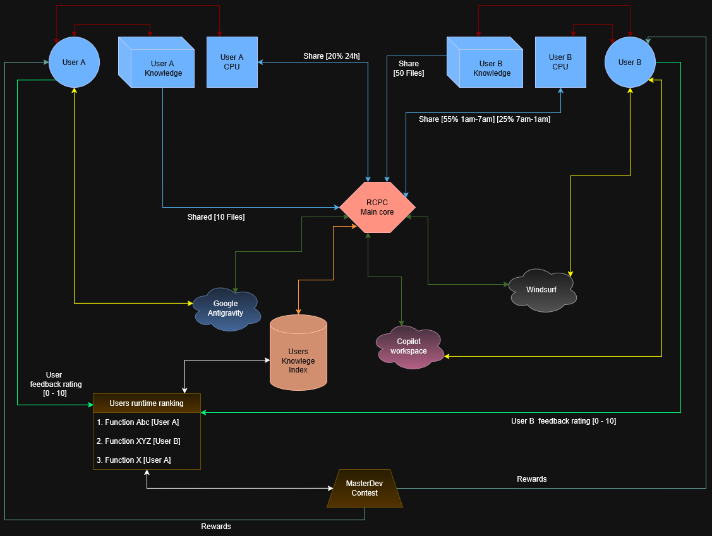

# RCPC Project 🌐
### Community Network for Processing and Knowledge

A conceptual proposal to democratize AI infrastructure through voluntary computing and intellectual merit, inspired by successful models such as **Folding@home**.
---

## 📃 TECHNICAL PROPOSAL: RCPC PROJECT 

 - Title: Community Network for Processing and Knowledge (Distributed Knowledge Sharing)
 - Vision: Democratization of AI infrastructure through voluntary computing and intellectual merit. 

1. Conceptual Rationale 
Inspired by successful models like Folding@home, the RCPC Project proposes that processing power and logical intelligence should not be restricted to large data centers. The network uses idle resources from home devices to create a living library of knowledge and execution. 

2. Local Agent Architecture (Terminal) 
The user maintains full control over their hardware through a simplified interface: 
    Resource Management: Strict definition of CPU percentage, selection of specific cores, and limits for RAM and GPU. 
    Shared Folder: Access to an isolated directory where the user places code snippets and the network places usage statistics. 
    Intelligent Translation: Use of AI to interpret logics submitted in any language (e.g., Pascal) and translate them into the optimized language of the final destination. 

3. Logic Economy and Incentives 
The system transforms contributions into tangible value: 
    Micro-rewards: Credit generation (e.g., Google Play, Steam, or direct funds) based on the volume of "collections" and validations of each node. 
    Configurable Altruism: Option to redistribute rewards to community funds for users who choose not to receive them. 
    Authorship Attribution: Mandatory inclusion of metadata comments in each distributed code block, ensuring permanent credit to the original author. 

4. Evolution and Recognition (MasterDev) 
The project culminates in identifying talent through pure technical meritocracy: 
    Impact Statistics: A global ranking based on the real efficiency and usefulness of the submitted code. 
    MasterDev Events: Global competitions to highlight the best "logic architects," regardless of their official academic background, focusing solely on the ability to solve complex problems with elegance and low resource consumption.  

---

## 📊 Data Flow Diagram (DFD)

The conceptual operation of RCPC is represented in the following diagram, which illustrates resource sharing, integration with external platforms, and the logical merit system:

This diagram shows:
- Voluntary contribution of CPU and knowledge by users
- Integration with platforms such as Antigravity, Windsurf, and Copilot Workspace
- Ranking and rewards system via MasterDev Contest
- Feedback and validation flow between users and the RCPC Main Core

## 🚀 Key Concepts
* **Voluntary computing:** Idle CPU/GPU/RAM resources for global logical processing.
* **Knowledge library:** A community repository of code snippets (Pascal, Assembly, Python, etc.).
* **Logic economy:** Micro-rewards and recognition for efficient contributors.
* **MasterDev:** Merit-based competitions for high-level developers.

---
*Created by a developer with a passion for logic since the Turbo Pascal era.*
